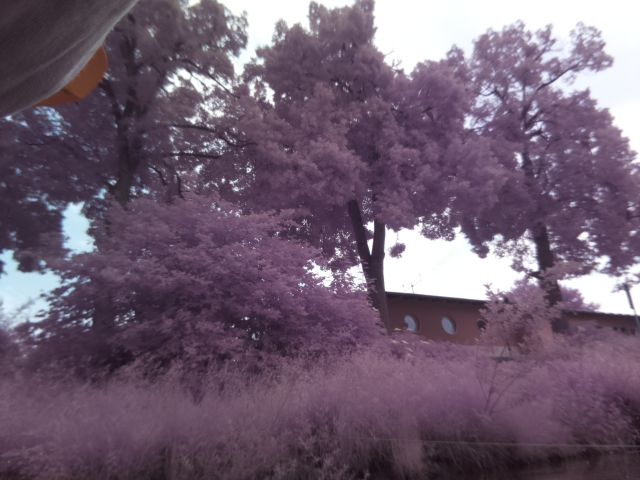
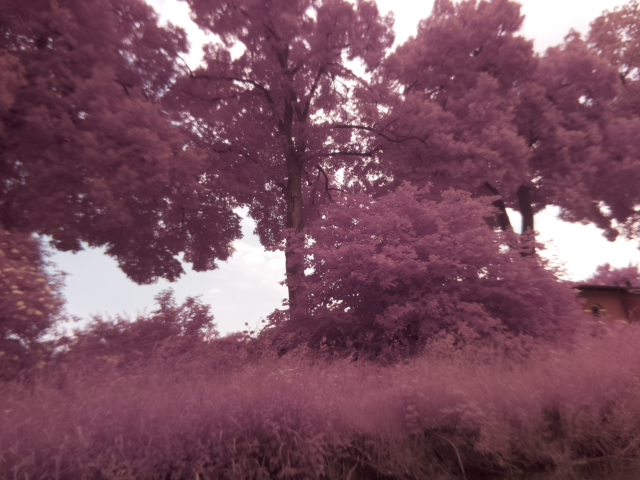
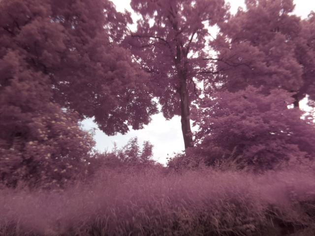
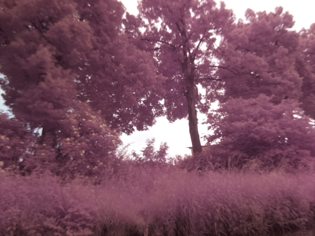
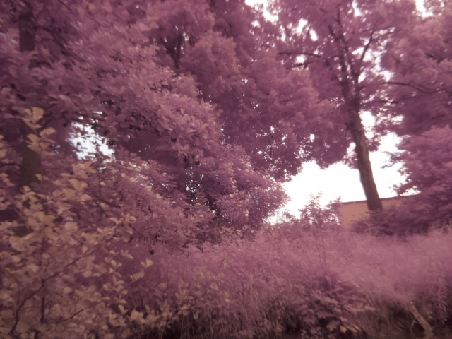

 <head>
       
<!-- jQuery version must be >= 1.8.0; -->

</head>

<section>
    
The Raspberry Pi Camera was programmed, that it takes a picture once per minute (see <a href="{{ 'cam_engl.html' | absolute_url }}">Equipment-Cameras</a>). In the end it looks like the following:
    
<!--style="width: 600px; height: 400px; top: 6px; left: 700px; opacity: 1;" -->
<!-- Container for the image gallery -->
        

            <ul id="lightgallery" class="list-unstyled row">
                
RaspiCam1</h4>
Picture 1: Trees and bushes at the river bank. Pictures are taken by Mr. Turtle from the Lahn river (Marburg/Germany).
">
                    
                

                
RaspiCam2</h4>
Picture 2: Trees and bushes at the river bank. Pictures are taken by Mr. Turtle from the Lahn river (Marburg/Germany).
">
                    
                

                
RaspiCam3</h4>
Picture 3: Trees and bushes at the river bank. Pictures are taken by Mr. Turtle from the Lahn river (Marburg/Germany).
">
                    
                

                
RaspiCam4</h4>
Picture 4: Trees and bushes at the river bank. Pictures are taken by Mr. Turtle from the Lahn river (Marburg/Germany).
">
                    
                

                
RaspiCam5</h4>
Picture 5: Trees and bushes at the river bank. Pictures are taken by Mr. Turtle from the Lahn river (Marburg/Germany).
">
                    
                
RaspiCam6</h4>
Picture 6: Trees and bushes at the river bank. Pictures are taken by Mr. Turtle from the Lahn river (Marburg/Germany).
">
                    
                
              
        </ul>

<!-- lightgallery plugins -->

<!--[if lte IE 8]><![endif]-->
 

<section>
    
<ul class="pagination">
        <li><a href="{{ 'Lidar_results.html' | absolute_url }}" class="button">Prev</a></li>
        <li><a href="{{ 'Sonar_results.html | absolute_url }}" class="page active">1</a></li>
        <li><a href="{{ 'Lidar_results.html' | absolute_url }}" class="page active">2</a></li>
        <li><a href="{{ 'Cameras_results.html' | absolute_url }}" class="page active">3</a></li>
        <li><a href="{{ 'Sonar_results.html | absolute_url }}" class="button">Next</a></li>
</ul>