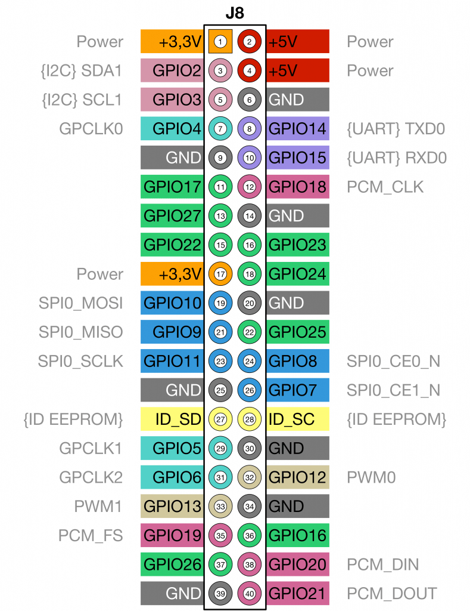

 This page is still in editing process !!!

Mr. Turtle is currently equipped with a Sonar-, Lidar- and a Temerature-Sensor. A Raspberry Pi 3 is logging the data and controlling how the single parts are working via simple programs. Additionally we need two servos to control driving direction. Several accus, two Motors and propellers, the Ardu-Pilot and an additional GPS are also on board. This page gives an Overview of: 

<ul>
    <li>the functioning of the platform</li>
    <li>how the equipment is set up on the platform</li>
    <li>how the equipment is connected to each other</li>
</ul>
<h2>Setting Raspberry Pi</h2>

	

        

				<table class="alt">
					<thead>
						<tr>
							<th>Cable connection</th>
							<th>GPIO set-up (Fig.2)</th>
              <th>GPIO set-up (Fig.2)</th>
              <th>Cable connection</th>
						</tr>
					</thead>
					<tbody>
                        <tr>
							<td>   </td>
							<td>3V</td>
                            <td>5V</td>
                            <td>   </td>
						</tr>
						<tr>
							<td>Lidar blue <--> blue </td>
							<td>SDA GPIO2</td>
							<td>5V</td>
                            <td>5V red Lidar</td>
						</tr>
						<tr>
							<td>Lidar green <--> green </td>
							<td>SCL GPIO3</td>
							<td>GND</td>
                            <td>GND black</td>
						</tr>
						<tr>
							<td>Temperature Sensor green</td>
							<td>GPIO4</td>
							<td>GPIO14 (TXD)</td>
                            <td>   </td>
						</tr>
						<tr>
							<td>   </td>
							<td>GND</td>
                            <td>GPIO15</td>
							<td>   </td>
						</tr>
						<tr>
							<td>Feedback blue</td>
							<td>GPIO17</td>
							<td>GPIO18</td>
                            <td>   </td>
						</tr>
                        <tr>
                            <td>   </td>
							<td>GPIO27</td>
                            <td>GND</td>
							<td>   </td>
                        </tr>
                        <tr>
                            <td>   </td>
							<td>GPIO22</td>
                            <td>GPIO23</td>
							<td>yellow --> Servo 1</td>
                        </tr>
                        <tr>
                            <td>   </td>
							<td>3V</td>
                            <td>GPIO24</td>
							<td>green --> Servo 2</td>
                        </tr>
					</tbody>
                    <tfoot>
                        <td colspan="4">Tab 1: Scatch of GPIO setting</td>
					</tfoot>
					<tfoot>
                        <td colspan="4">...</td>
                    </tfoot>
				</table>     
    

    
            
            
 Fig 1: Foto of plumbed Raspi 

    

        
            
            
 Fig 2: Set-up Raspberry Pi 3 of <a href="https://indibit.de/raspberry-pi-die-gpio-schnittstelle-grundlagenbelegung/">https://indibit.de/raspberry-pi-die-gpio-schnittstelle-grundlagenbelegung/</a>

 Literature/Info for the following Sensor Pages: Servos 5V, Temp 3V, Lidar 5V

<ul>
    <li><a href="https://tutorials-raspberrypi.de/raspberry-pi-temperatur-mittels-sensor-messen/">https://tutorials-raspberrypi.de/raspberry-pi-temperatur-mittels-sensor-messen/</a></li>
    <li><a href="https://mobiusstripblog.wordpress.com/2016/12/26/first-blog-post/ ">https://mobiusstripblog.wordpress.com/2016/12/26/first-blog-post/ </a></li>
    <li><a href="https://www.instructables.com/id/Raspberry-Pi-Tutorial-How-to-Use-a-Buzzer/">https://www.instructables.com/id/Raspberry-Pi-Tutorial-How-to-Use-a-Buzzer/</a></li>
    <li><a href="https://codingworld.io/project/der-servo-am-raspberry-pi">https://codingworld.io/project/der-servo-am-raspberry-pi</a></li>
    <li><a href="https://www.datenreise.de/raspberry-pi-wie-verwendet-man-ein-breadboard-steckplatine-anleitung/">https://www.datenreise.de/raspberry-pi-wie-verwendet-man-ein-breadboard-steckplatine-anleitung/</a></li>
</ul>