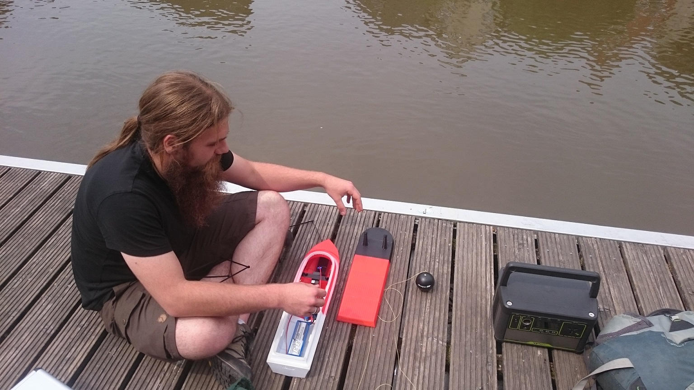
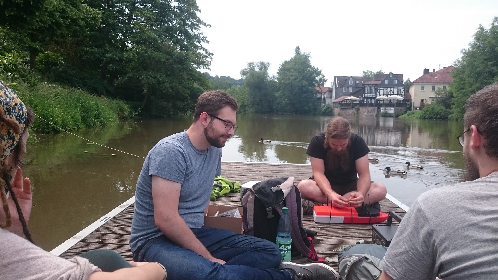
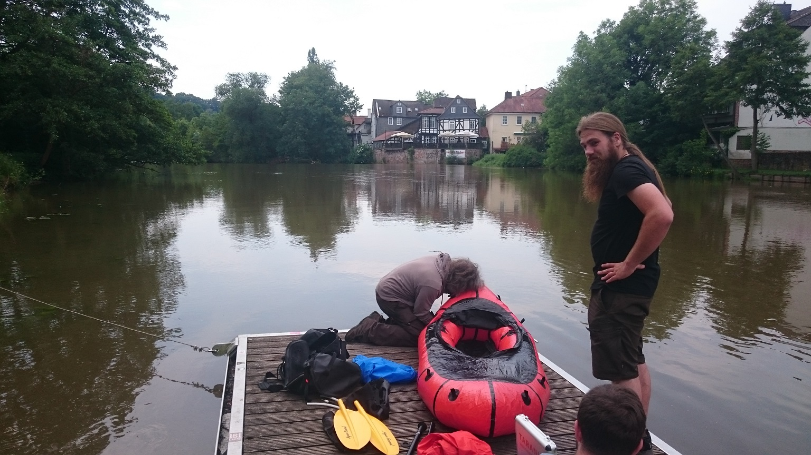
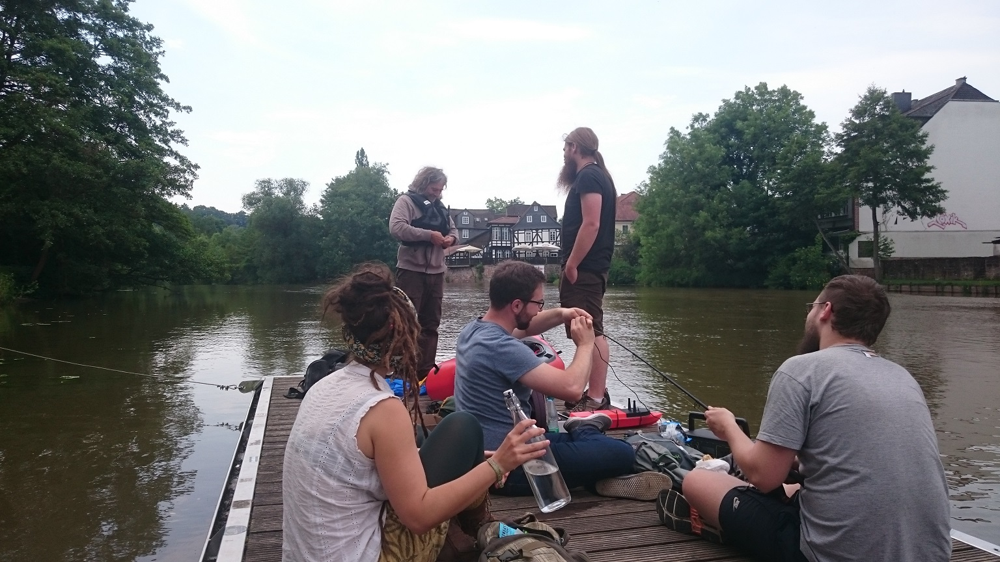
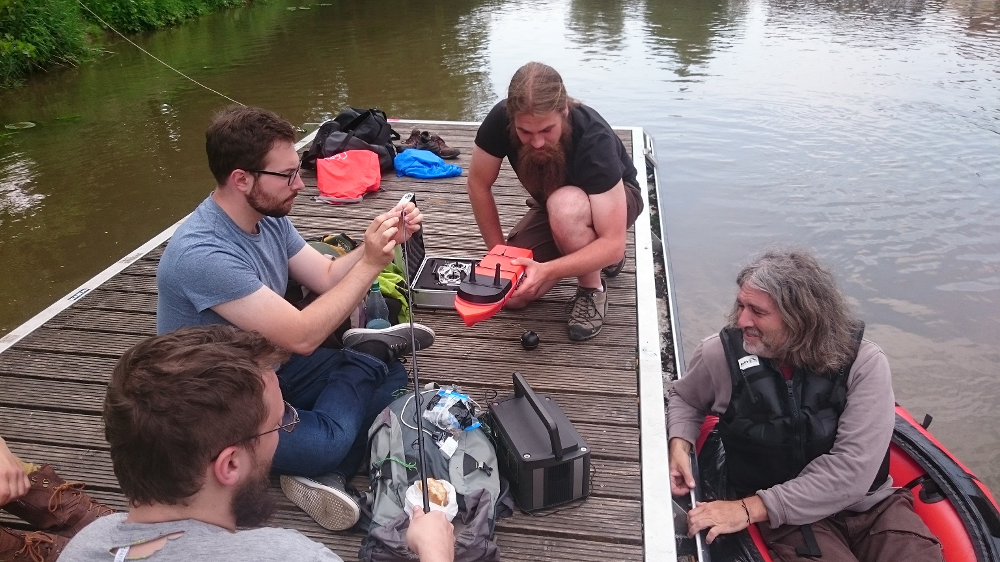
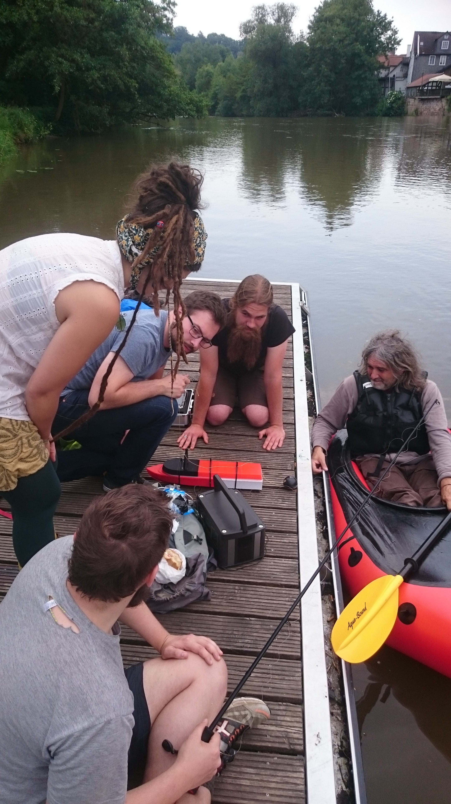
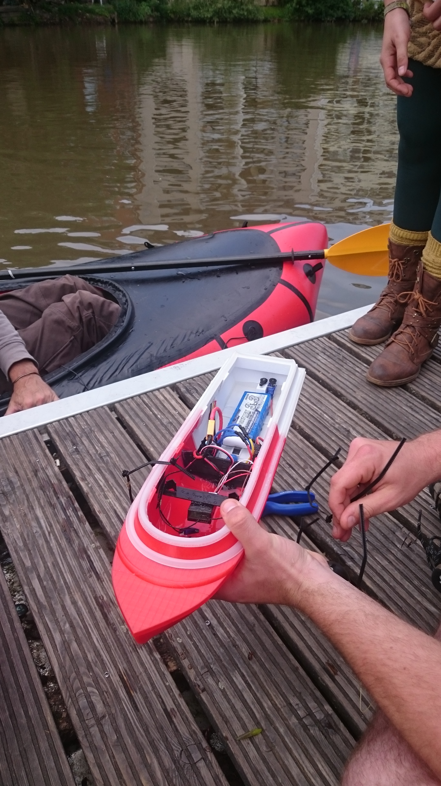

 <head>
       
<!-- jQuery version must be >= 1.8.0; -->

</head>

<section>
    <body>
    
<!--style="width: 600px; height: 400px; top: 6px; left: 700px; opacity: 1;" -->
<!-- Container for the image gallery -->
        

            <ul id="lightgallery" class="list-unstyled row">
                
Preparations1</h4>
Connecting the ArduPilot with the accu for the first Test run...
">
                    
                

                
Preparations2</h4>
Last steps to get ready for sea?!
">
                    
                

                
Preparations3</h4>
Charging the Camera. The Sonar (black ball) will be connected to the boat by a line.
">
                    
                

                
SavetyStuff1</h4>
Preparing the safety boat...
">
                    
                

                
SavetyStuff2</h4>
... And don´t forget the savety west! The Sonar gets a safety fishing rod.
">
                    
                

                
SavetyStuff3</h4>
The Sonar gets a safety fishing rod 2...
">
                    
                

                
AfterCheck</h4>
Is everything alright after the first drive?
">
                    
                

                
WaterInBoat</h4>
AAHHH, Water in the boat!
">
                    
                
                
        </ul>

<h1>Videos</h1>

3D-printed boat</h4>
Test run of 3D-printed boat
">
                <video style="width: 420px; height: 500px; top: 6px; right: 180px; padding-right: 30px; border: solid 1px rgba(210, 215, 217, 0.75); border-top: 0; border-left: 0; border-bottom: 0;" controls>
                    <source src="{{ 'assets/images/TestRun/VideoTR4_Komp11.mp4' | absolute_url }}" type="video/mp4">
                </video>
                

<!-- lightgallery plugins -->

<!--[if lte IE 8]><![endif]-->

</body> 

<section>