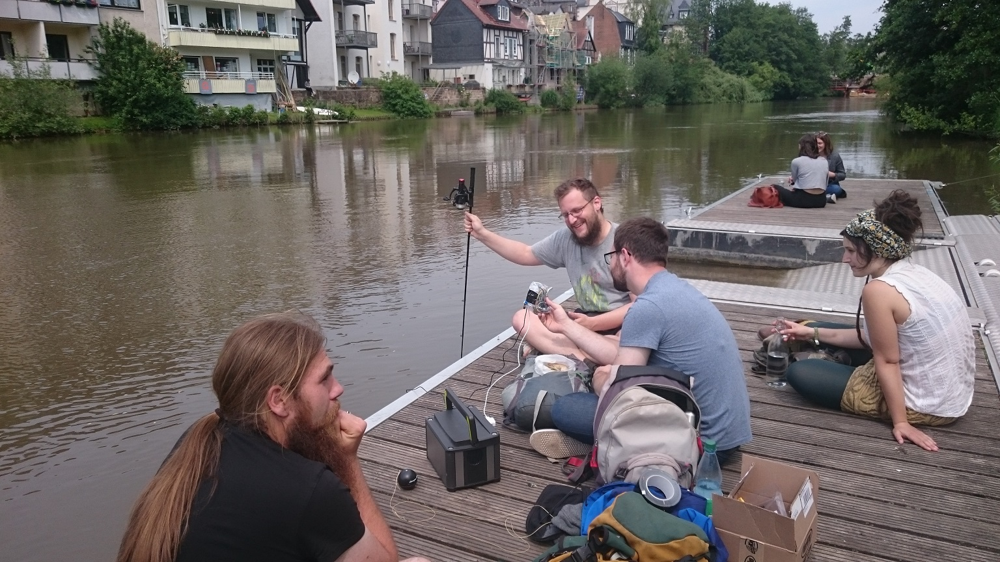

 <head>
       
<!-- jQuery version must be >= 1.8.0; -->

</head>

<section>
    <body>
<h1>Videos</h1>

Test Run 3D printed Boat</h4>
Water in the boat
"><video controls><source src="{{ 'assets/videos/TRboat3D.mp4' | absolute_url }}" type="video/mp4">
                </video><b>Test Run 3D printed Boat</b> Water in the boat<h4>3D printed Boat</h4>For the first test drive we connected the boat to a fishing line for security reasons. The boat is quite manoeuvrable but also very shaky while driving. The latter is a big minus concerning our plans to scan riparian vegetation. In addition the wave-powered propulsion system makes it quite difficult to prevent water from penetrating into the boat. We endet up being a hair's breadth away from wet and broken electronics.

                

The Catamaran</h4>
Testing the first catamaran prototype
"><video controls><source src="{{ 'assets/videos/TRcatamaran.mp4' | absolute_url }}" type="video/mp4">
                </video><b>Testing the first catamaran prototype</b> Water in the boat<h4>The Catamaran</h4>The catamaran is an approach to achieve a more stable drift and more space for the sensors. More mayyybee yes, but stable drift... OOuups... not yet!

                

Mr. Turtle #1</h4>
Smoking motor
"><video controls><source src="{{ 'assets/videos/smokingEngine.mp4' | absolute_url }}" type="video/mp4">
                </video><b>Mr. Turtle #1</b> Smoking motor<h4>Mr. Turtle #1</h4>Mr. Turtle #1 drifts much more stable on the watersurface. For some reason one of the two motors started smoking when we were testing our first floating platform prototype. Consequently the propulsion system hat to be improved.

                                

Mr. Turtle #2</h4>
Test run of the final version of Mr. Turtle
"><video controls><source src="{{ 'assets/videos/index_trans3.mp4' | absolute_url }}" type="video/mp4">
    </video><b>Mr. Turtle #2</b> Manual control mode<h4>Mr. Turtle #2</h4>This is a test run of the final Mr. Turtle version without sensors in manual mode. We are testing if updrift is strong enough, the manoevrability in manual mode and the automatic mode. Updrift was strong enough, the platform stayed largely dry. Manoevrability was appropriate for Mr. Turtle´s size and it´s function as a Limno-explorer, what means moving with low speed while performing measurements. One Problem with the propulsion couldn´t be fixed by now: The cogwheels turn discontinously and sometimes get stuck somehow, so it might happend that the propellers have to be rearranged parallel manually.
    

    

Mr. Turtle #2</h4>
Automatic control mode
"><video controls><source src="{{ 'assets/videos/TR4automatic.mp4' | absolute_url }}" type="video/mp4">
                </video><b>Mr. Turtle #2</b> Automatic control modeWhile testing the boat with full sensor equippment we had our biggest success: Automatic mode is working!!!

                
</body>

<section>
<section>    
<body>

<h1>More Images</h1>
<!--style="width: 600px; height: 400px; top: 6px; left: 700px; opacity: 1;" -->
<!-- Container for the image gallery -->
        

            <ul id="lightgallery" class="unstyled row">
                
Preparations1</h4>
Connecting the Pixhawk with the Lipo to start the first Test run...
">
                    
                

                
Preparations2</h4>
Last steps to get ready for sea?!
">
                    
                

                
Preparations3</h4>
Charging the Camera. The Sonar (black ball) will be connected to the boat by a line.
">
                    
                

                
SavetyStuff1</h4>
Preparing the safety boat...
">
                    
                

                
SavetyStuff2</h4>
... And don´t forget the savety west! The Sonar gets a safety fishing rod.
">
                    
                

                
SavetyStuff3</h4>
The Sonar gets a safety fishing rod 2...
">
                    
                

                
AfterCheck</h4>
Is everything alright after the first drive?
">
                    
                

                
WaterInBoat</h4>
AAHHH, Water in the boat!
">
                    
                
                
        </ul>

<!-- lightgallery plugins -->

<!--[if lte IE 8]><![endif]-->

</body> 
<section>