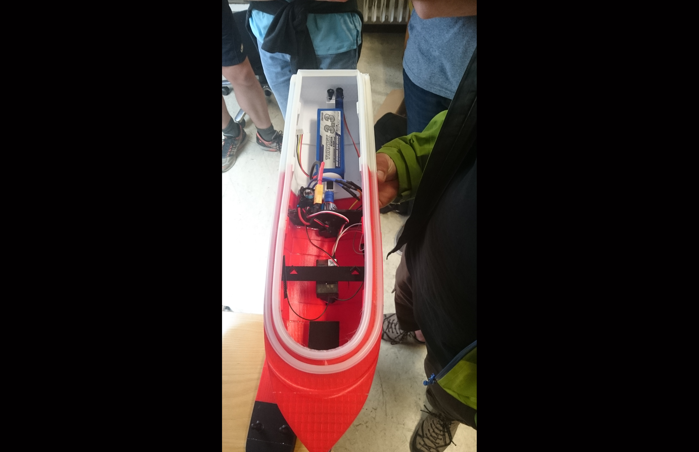
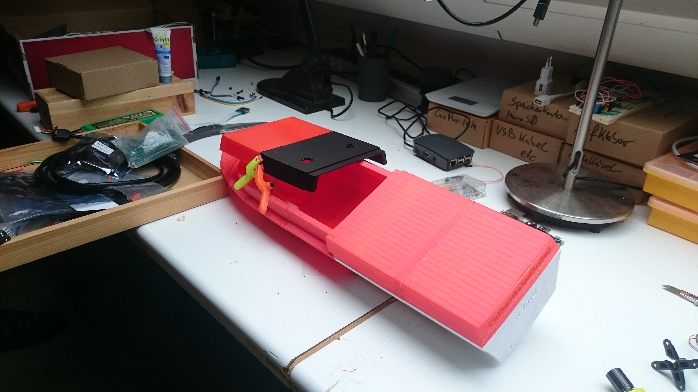
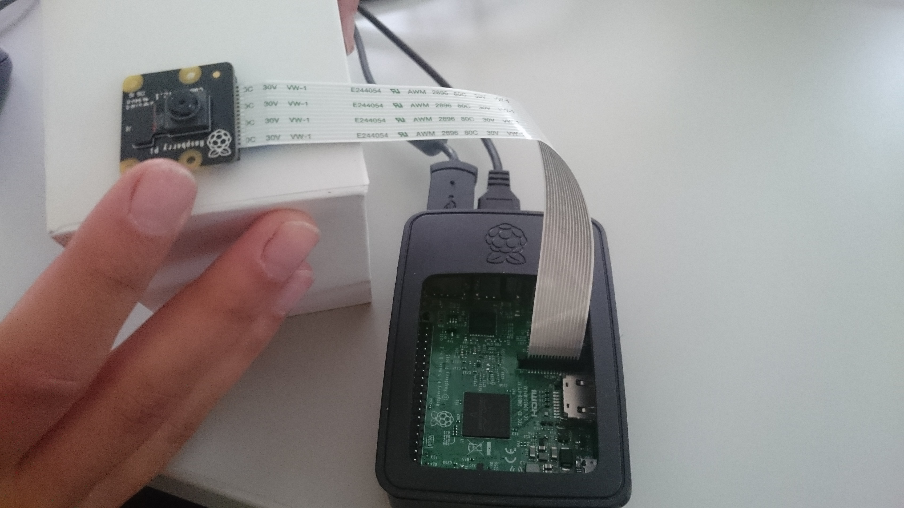
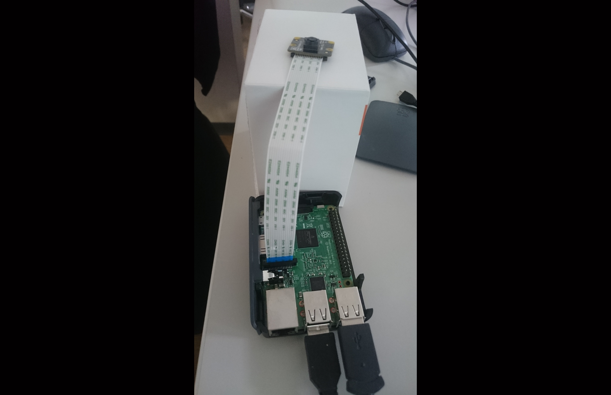

 <head>
       
<!-- jQuery version must be >= 1.8.0; -->

</head>

<section>
    <body>
    
<!--style="width: 600px; height: 400px; top: 6px; left: 700px; opacity: 1;" -->
<!-- Container for the image gallery -->
        

            <ul id="lightgallery" class="list-unstyled row">
                
3DPrintBoat</h4>
C3D printed boat with motor, accu, rudder and ship wave
">
                    
                

                
Construction1</h4>
Glueing the boat top 1
">
                    
                

                
Construction2</h4>
Glueing the boat top 2
">
                    
                

                
RaspiCam2</h4>
Connecting RasPi-Cam 1
">
                    
                

                
RaspiCam2</h4>
Connecting RasPi-Cam 2
">
                    
                
              
        </ul>

<h1>Videos</h1>

<!-- lightgallery plugins -->

<!--[if lte IE 8]><![endif]-->

</body> 

<section>
    
