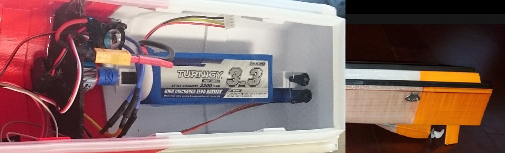
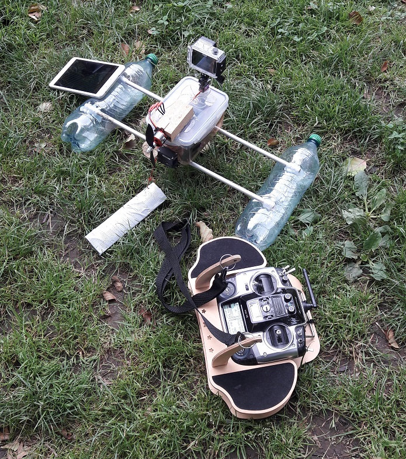
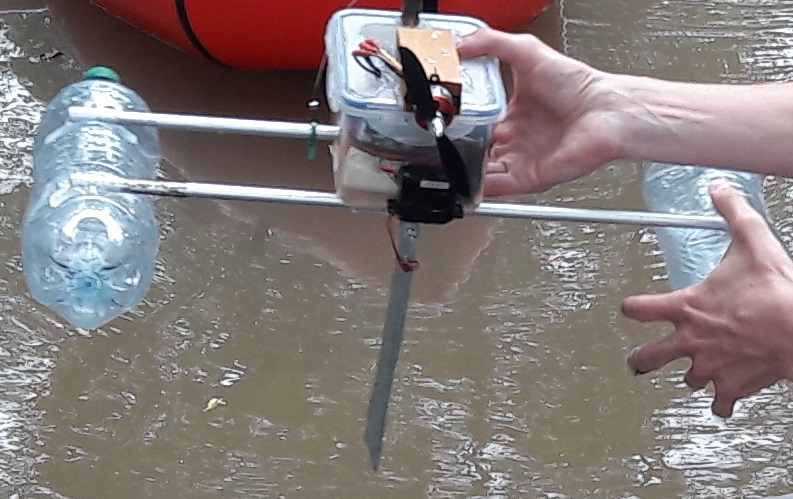
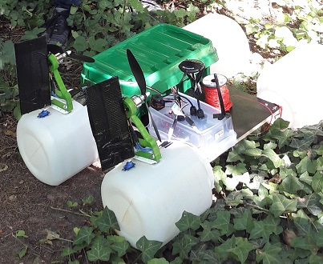
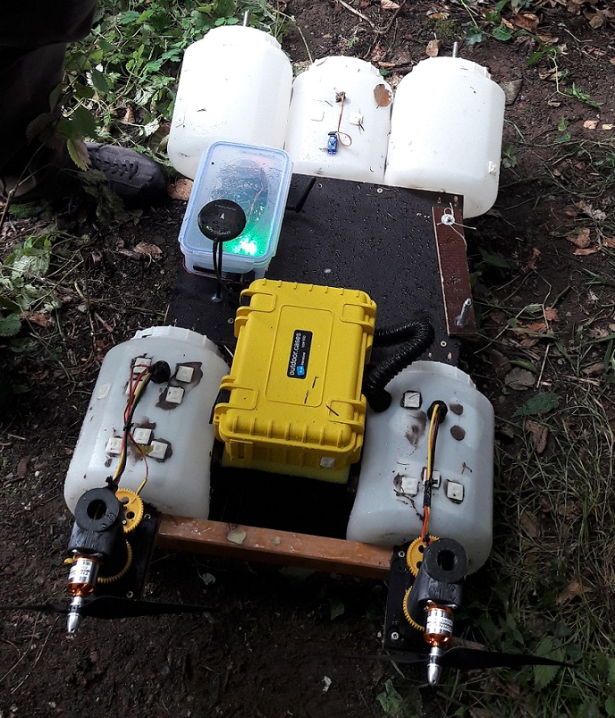
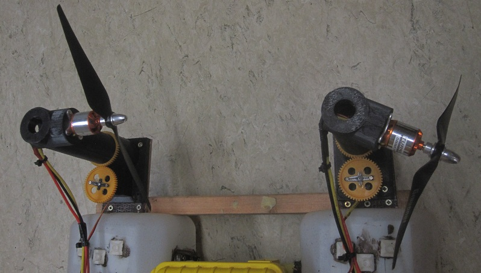

The development of Mr. Turtle involved many testings, optimizing processes, failures and re-starts. We tested several prototypes until we worked our way forward to a version, which fulfilled all requirements. The main difficulties were:

<li>to store all sensors</li>
<li>to store all sensors waterproof</li>
<li>to store the sensors with enough distance between each other, so that they don´t interfere</li>
<li>to make the installations unsusceptible against vibrations</li>
<li>to find a way of a stable drift without big disturbances by waves and currents</li>
<li>to overcame the problem of entanglement in waterplants</li>
<li>low costs</li>

The way we handled these problems and what steps we took to develop the final outcome is explained in the following paragraphs.

<h2>The 3D Printed Boat</h2>

We started with the boat "n3m0" (Abb. 1), of which we found a very detailed instruction on <a href="https://hackaday.io/project/25508-n3m0-the-autonomous-boat">hackaday</a>. The concept came very close to our idea, what promised a quick start into the sonar boat project. The propulsion is generated by a propeller shaft and an under water propeller (Abb. 2). The stearing is done by a rudder.
To build the boat we needed:

<li>1 pixhawk</li>
<li>1 Raspberry Pi</li>
<li>1 Breadboard</li>
<li>wires</li>
<li>Deeper Smart Sonar Pro+</li>
<li>Android operated mobile Phone</li>
<li>1 1000kV motor, D2830 with 3.17 (1/8”) shaft</li>
<li>Prop shaft – motor coupler, 3.17mm</li>
<li>Speed Control. Waterproof, brushless ESC, 45A</li>
<li>Prop shaft & tube 1/8 shaft.</li>
<li>Standard servos for steering</li>
<li>A Lithium Ion Polymer battery</li>
<li>The Pixhawk PX4 autopilot set</li>
<li>A Radio Transmitter and receiver</li>
<li>Raw material for the 3D printer & the 3D print model</li>

    

        
Fig. 1: 3D printed boat in action

        
Fig. 2: Motor set up (left), rudder and screw (right) of the boat

    

<h3>Testing results</h3>    

The boat was easy to put together. It drove, although quite unstable and it didn´t conquer the waves and currents easily. A big problem was size. There wasn´t much space left to store the equipment save from water and interferences between different GPS modules occured. 
We thought about solving those problems by printing the same boat again and convert it to a catamaran but as the printing process took several days we decided to start all over.

<h2>The First Catamaran Prototype</h2>

 idea: two connected floats with a waterproof box in the middle to store electronic devices (Abb.3). A propeller is pushing the boat and a water rudder is in charge of changing direction (Abb.4).
 
 Except for the box, nothing else needed to be bought.

    

        
Fig. 3: First catamaran prototype

        
Fig. 4: Proculation of the catamaran prototype

    

<h3>Testing results</h3>

 The boat was floating much smoother on the water surface due to a small immersion depth. Nevertheless it was too small for our project, so we take the next step: a bigger catamaran.

<h2>The Second Catamaran-like Prototype</h2>

The first floating platform is meant to be a bigger, robust version of the catamaran prototype (Abb. 5). The propulation differs as the rudder is placed behind the propellers instead of in the water (Abb. 6). The mounting of the motors is printed by a 3D printer. The model is designed by us. As the platform is much bigger and havier, we mounted two motors.
 

From the DIY market and from the internet we bought:

<li>many screws and nuts in different sizes</li>
<li>threaded rods in different sizes</li>
<li>wooden board with waterproof surface</li>
<li>sealable plastic boxes</li>
<li>a metal saw</li>
<li>silicone</li>
<li>screw cabs</li>
<li>glue</li>
<li>float canisters</li>
<li>metal plates with wholes to strengthen the float´s walls</li>

				

					
Fig. 5: First Mr. Turtle platform prototype

					
Fig. 6: Proculation of platform

                

<h3>Testing results</h3>

The catamaran-like platform is floating on the water and even on solid ground, what makes it very easy for Mr. Turtle to get on the water. Trudging through muddy riverbanks can be skipped. Nevertheless the propeller mounting was too fragile and steering was too indirect. Additionally Mr. Turtle had a big immersion depth, so that the platform was close to being covered by water. 

    
<h2>Mr. Turtle got mature</h2>

Another 3D print for a new, very robust porpeller mounting, which turnes the propellers directly satisfied our demands to the sonar boat project. There´s enough space for all the sensors and electrical devices plus waterproof boxes. The equipment can be extended without problems. It drafts on the river stably and the platform doesn´t get wet, except from some splashes. It is quite agile when turning, although the manoeuvrability could still be improved.

Additional equipment:

<li>Lidar Lite 3</li>

				

					
Fig. 7: First test of Mr. Turtle platform

					
Fig. 8: Proculation system of Mr. Turtle

                

<h3>Testing results</h3>

Mr. Turtle passed both tests, manual and automatic mode. The automatic mode is still unprecise as the river currents and wind are pushing the boat. 

