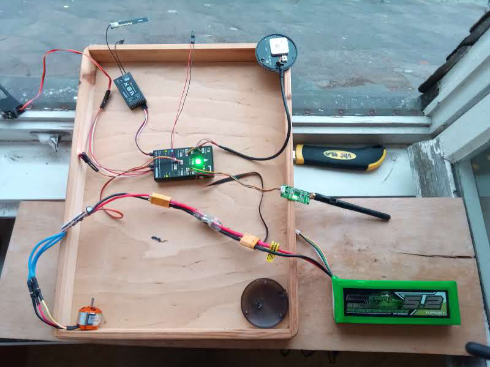

There are two possibilities to tell the boat, where to go: manually with a flight control or in Automatic Mode.

<h3>Manual</h3>

Fig. 1: Programmable flight control (<a href="https://www.graupner.de/">GRAUPNER</a>)To control Mr. Turtle manually we used a programmable flight control (Fig. 1). Therefore we first adjusted the setting and the joysticks to the Turtle´s propulsion system. More about the setting of the GRAUPNER with the remote control system mx-16 HoTT you find here: <a href="https://www.graupner.de/media/pdf/9a/f1/69/33116_mx16-HoTT-17-de.pdf">https://www.graupner.de/media/pdf/9a/f1/69/33116_mx16-HoTT-17-de.pdf</a>. The pixhawk (Fig. 2) on board of the Turtle receives the signal.

<h3>Automatic Mode</h3>

Fig. 2: Pixhawk connections to: Lithium Ion Polymer Battery, Telemetry radio, GPS, buzzer, receiver, servo, motor With the <a href="http://ardupilot.org/about">ArduPilot Software</a>, an open source autopilot system, the route of Mr. Turtle can be planned in advance. With the GPS the <a href="http://ardupilot.org/copter/docs/common-pixhawk-overview.html">pixhawk</a> (Fig. 2) is able to lead the boat along this route.

