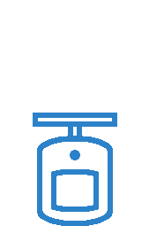

<!-- Section -->
<section>
	<header class="major">
		<h2>Documentation</h2>
	</header>
	

		<article>
			
                
            
			

				<h3>Platform Development</h3>
				
Here the formation process of the Turtle is described, sucsesses and fails included 

			

		</article>
		<article>
			
            
            
			

				<h3>Sensors</h3>
				
In this menu you find informations about Lidar, Sonar, tamperature sensors and camera and how to use them on the Raspberry Pi

			

		</article>
		<article>
			
            
            
			

				<h3>Control</h3>
				
Automatic and manual driving mode are explained

			

		</article>
		<article>
			<a href="{{ 'control.html' | absolute_url }}" class="image"></a>
			

				<h3>Results</h3>
				
Examples of how the data results could look like are shown here

			

		</article>
	

</section>

<!-- Section -->
<section>
	<header class="major">
		<h2>Gallery</h2>
	</header>
	

		<article>
			
			<h3>Work in progress</h3>
			
Here you can get an impression of our working procedure. Step by step we´re approaching our target: An autonomous driving platform equipped with running sensors.

			<ul class="actions">
				<li><a href="{{ 'WorkinProg.html' | absolute_url }}" class="button">More</a></li>
			</ul>
		</article>
		<article>
			
			<h3>Test Runs</h3>
			
This Gallery is a documentation of our test runs, fails and successes.

			<ul class="actions">
				<li><a href="{{ 'TestRuns.html' | absolute_url }}" class="button">More</a></li>
			</ul>
		</article>
	

</section>
